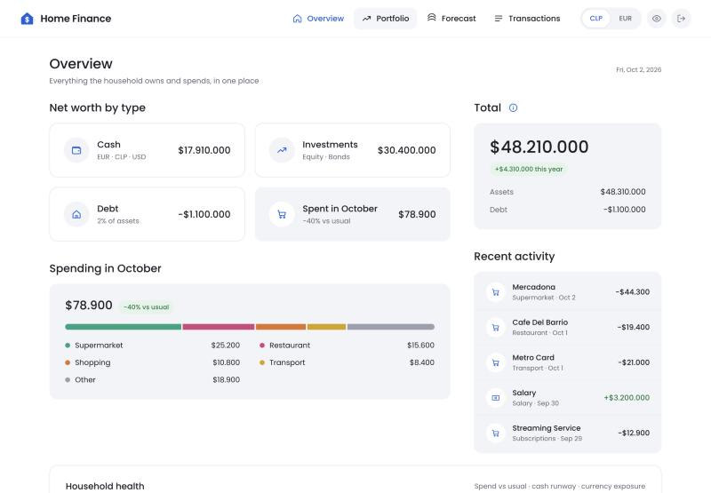

# Home Finance

A full-stack personal finance app for a two-person household spanning **Spain (EUR)** and **Chile (CLP)**, with USD-priced investment holdings — built to solve a real, personally-annoying problem: no existing budgeting app handles multi-currency households and manual bank-statement workflows without either mangling FX or requiring bank API access neither bank offers.

FastAPI + SQLAlchemy backend, React + TypeScript frontend, and a categorization pipeline that starts with rules and only falls back to a local LLM when rules run out.



## What it does

- **Imports real bank statements** — parsers for Revolut (CSV), Santander España (xlsx), and Scotiabank Chile (xls), each handling that bank's specific quirks (locale decimal formats, sparse layouts, minus-sign encoding). Plus **near-live ingestion**: Santander ES sends a transaction email per purchase, pulled over IMAP and fed through the same import pipeline so the dashboard updates without waiting for a monthly statement.
- **Categorizes automatically, and learns from corrections** — a five-stage cascade (exact rule match → whole-word substring → fuzzy match → local LLM via Ollama → fallback) that gets faster and more accurate as you correct it; manual corrections always win and are never overwritten by the automated stages.
- **Tracks net worth across currencies** — cash balances (manually maintained — imported transaction history is inherently partial, so it never drives the bank balance), investment holdings priced live (yfinance / Fintual) and converted through a single FX contract, and debt.
- **Runs Monte Carlo retirement/goal forecasts** — vectorized NumPy simulation using historical block-bootstrap sampling of real asset returns (not a Gaussian assumption), with correlated income/spending shocks in down markets, real or nominal terms, and a full assumptions editor.
- **Reviews portfolio health** — a deterministic rules engine that scores your holdings against an investment-policy profile built from a short questionnaire, with explainable findings (and an optional local-LLM layer that explains findings in plain language — it never invents them or gives buy/sell advice).

Manual data entry only — no bank APIs, because none of the banks involved offer one to individual users. Tax is explicitly out of scope.

## Tech stack

**Backend:** FastAPI · SQLAlchemy 2.0 · Alembic · Pydantic · pytest
**Frontend:** Vite · React · TypeScript · TanStack Query · Recharts
**Data/ML:** NumPy (Monte Carlo forecasting) · RapidFuzz (categorization) · Ollama / Llama 3.1 8B (local LLM categorization + brief explanations) · yfinance / Fintual (pricing)

## Architecture invariants

- **Base/reporting currency is CLP everywhere.** EUR is a display-only toggle applied as a single conversion at render time — never stored pre-converted.
- **Money is never stored pre-converted.** Transactions store native `amount + currency + fx_rate_to_base` captured at the transaction date; holdings store `quantity + price_currency`, valued at read time.
- **Exactly two FX conversion entry points exist**: `to_base` (historical, for spending) and `to_base_current` (latest, for holdings/net worth). Anywhere else doing FX math is a bug.
- **All amounts are `Numeric(18,4)`** — never floats for money.
- **No raw SQL** — everything through the SQLAlchemy ORM; Alembic is the source of truth for schema.
- **All external API keys are server-side only** — the frontend only ever talks to FastAPI.
- FX and price providers sit behind swappable interfaces (`FxProvider`, `PriceProvider`), so a provider outage or pricing change doesn't ripple through the codebase.

## Local dev

One-command launch (starts backend + frontend together):

```bash
./dev.sh
```

Or run them separately:

```bash
# Backend (port 8000)
cd backend
python3 -m venv .venv
.venv/bin/pip install -e ".[dev]"
cp .env.example .env        # fill in FX/price/Gmail/Ollama keys — all optional, features degrade gracefully
.venv/bin/alembic upgrade head
.venv/bin/uvicorn app.main:app --reload --port 8000

# Frontend (port 5173)
cd frontend
npm install
npm run dev
```

Open <http://localhost:5173>.

```bash
# Backend checks
.venv/bin/pytest                            # 15 test files
.venv/bin/ruff check app && .venv/bin/mypy app

# Frontend checks
npm run lint
npm run build       # TS check + bundle
```

## Status

Phases 1–7 of the build plan are complete: data import, categorization, spending dashboard, net worth, Monte Carlo forecasting, and a full assumptions editor. Phase 8 (debt terms — amortization schedules) is next.

Portfolio Health Review — a rules-based investment-policy scoring engine, built outside the original phase plan — has its first stage shipped (profile questionnaire, deterministic scoring, explainable findings); liquidity/stress-testing and an AI explanation layer are planned next.
